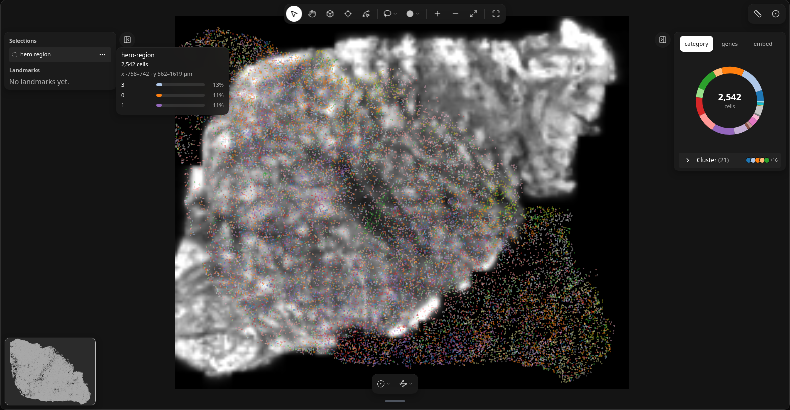

<p align="center">
  
</p>

# milume

**Milume: a thinking surface for spatial omics.**

A tactile, reactive widget that harnesses your scientific intuition.

Layer your data, select what catches your eye, and pick up where you left off in code.

Milume is a simple, reactive Jupyter ([anywidget](https://anywidget.dev)) surface for forming
intuition about spatial omics data, which then drives the analysis that follows. The name
comes from *mille* (thousand, as in mille-feuille, layers) + *lume* (light).

| Tool | Role | Demo |
| ---- | ---- | ---- |
| **LandmarksWidget** | Draw selections and landmarks on tissue coordinates; measure from the notebook | [](https://molab.marimo.io/github/ckmah/milume/blob/main/demos/landmarks.py) |


More widgets and helpers may land here over time.

## Install

```bash
pip install milume
```

### Formerly spatial-rx

Milume was called `spatial-rx`. The API is unchanged; only the names moved:

```bash
pip uninstall spatial-rx
pip install milume
```

```python
import milume   # was: import spatial_rx
```

The final `spatial-rx` release is a thin shim that depends on `milume` and
re-exports it from `spatial_rx` with a `DeprecationWarning`.

## Alongside other viewers

Milume complements other viewers. Use Milume to form intuition: layer images, cells,
and transcripts in a notebook, select what stands out, and carry the selection straight
into your analysis code. Use heavier viewers when you need to inspect in depth.
Landmarks and selections round-trip as plain geometry and `obs_names`, so you can hand
the same regions to any viewer.

From source:

```bash
uv sync --extra demo --group dev
```

## LandmarksWidget

<picture>
  <source media="(prefers-color-scheme: dark)" srcset="assets/landmarks_widget_dark.png" />
  <source media="(prefers-color-scheme: light)" srcset="assets/landmarks_widget_light.png" />
  
</picture>

Draw selections and landmarks on tissue coordinates, color by category or gene,
expand neighborhoods, and inspect the 3D tissue under a window.

```python
import milume

w = milume.peek(adata, color="cell_type")   # AnnData with obsm["spatial"]
w = milume.peek(sdata, color="cell_type")   # SpatialData on disk: adds the 3D cube
```

From a SpatialData, the widget finds the table, the labels element it
annotates, a 3D image on the same grid, and their µm frame (override with
`table=`, `image=`, `labels=`; `contrast_limits=` for the image). Press **I**
(Inspect): hovering shows a live coarse preview of the tissue under the
cursor, and a click places a 300 µm window and docks a floating
full-resolution cube of it, colored like the map, with your landmarks drawn on
top. **Save** in the dock's title bar adds the window as an **inspect
selection** to its history strip. Read the inspected cells back with
`w.get_obs_names(adata, "<inspect id>")` or `w.selections`. Hold
**Space** to pan in any tool.

Read results back in Python:

| Need | Call |
| --- | --- |
| Cells in a selection | `w.get_obs_names(adata, selection_id)`, `w.assign_obs_mask(adata, key, selection_id)` |
| Landmarks as geometry | `landmarks_to_geodataframe(w.landmarks)` |
| Measure against landmarks | `distances`, `composition`, `along_positions` (+ `write_obs`) |
| Compare a subset with the tissue | `enrichment(adata, obs_names, obs_key=...)` |
| XY vs 3D neighbors | `nearest_distances(adata, seeds, obs_key=...)` (needs `obsm["spatial"]` x, y, z) |
| Map colors for other plots | `w.category_colors("cell_type")` |
| Inspect window and cube cut | `w.inspect_cx`, `w.inspect_cy`, `w.inspect_size_um`; `w.volume_cut` = x0, x1, y0, y1, z0, z1 µm (intersect X/Y with the window for the shown box) |

Large expression matrices are sent sparse; pass `genes=` to limit the gene
catalog.
